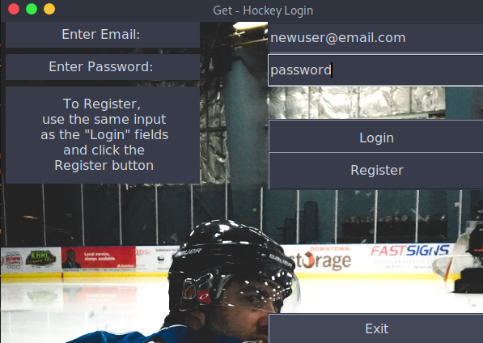

# Python GUI using Tkinter
# NHL Team Stats

# Users can Register/Login from the main screen. Or Exit.

# Users are validated using the Firebase API

# Users taken to the login screen 

# Find your teams Points and record using the NHL API

# Last place button of shame. Oh Red wings...

# Logout and your done! You can log back in whenever.
