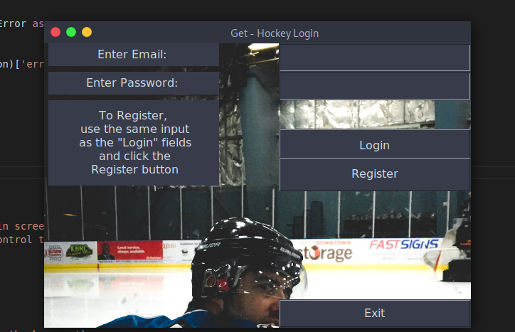
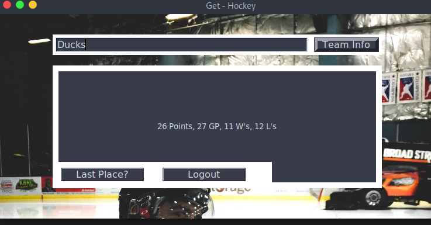
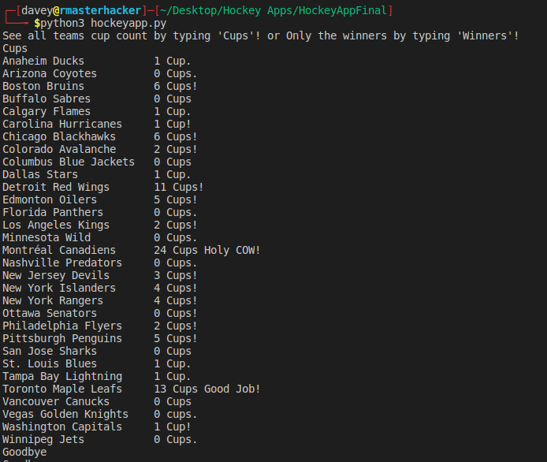
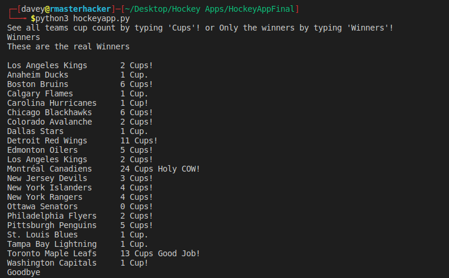
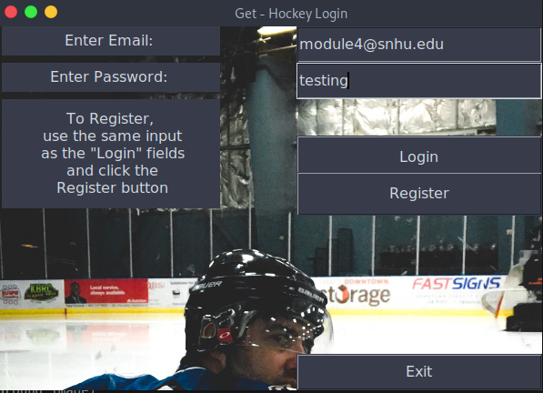
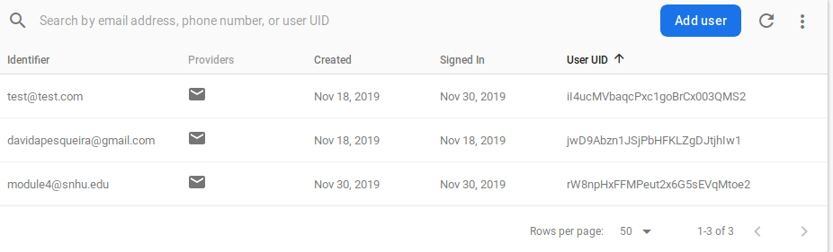

- Python GUI using Tkinter
- NHL API Access
- Tkinter Firebase Login/Register

[](http://www.youtube.com/watch?v=sLUrJUBy4hY "Code Review and Plans")


I started with a weather app using tkinter that I had made a little while back and chose this as an artifact to use that I can enhance by using methods I have learned while enrolled in my Computer Science program at Southern New Hampshire University. Tkinter has great documentation but I did not see any other project that had a Firebase Login system where the database for users would be stored there, instead of hardcoding passwords or storing them in a file. 

The project can be found here
https://github.com/DavidPesqueira/hockeypy





This is the design code for the login screen
Using the .geometry feature I can control the window sizes and 
where they open. 

```
canvasLogin = tk.Canvas(top)
canvasLogin.pack()
top.geometry('600x400+650+200')
background_image2=tk.PhotoImage(file='hockey.png')
backround_label2 = tk.Label(top, image=background_image2)
backround_label2.place(relwidth=1, relheight=1)


canvas = tk.Canvas(root)
canvas.pack()
root.geometry('750x350+650+200')

background_image=tk.PhotoImage(file='hockey.png')
backround_label = tk.Label(root, image=background_image)
backround_label.place(relwidth=1, relheight=1)
frame = tk.Frame(root, bg='white', bd=5)
frame.place(relx=0.5, rely=0.1,relwidth=0.75, relheight=0.1, anchor='n')
```


Adding Data Structures and Algorithm

The BST is used to insert and remove as an Easter Egg for those who use the CLI to run the python file

For insterting...




```
class node(object):
    def __init__(self, data):
        self.data=data
        self.leftchild=None
        self.rightchild=None
        
    def insert(self,data):
        if data<self.data:
            if not self.leftchild:
                self.leftchild=node(data)
            else:
                self.leftchild.insert(data)
        else:
            if not self.rightchild:
                self.rightchild=node(data)
            else:
                self.rightchild.insert(data)
```


And an example...


```
def teamcups():
  
    cups = input("See all teams cup count by typing 'Cups'! or Only the winners by typing 'Winners'!\n")
    if cups == "Cups":            
        bst.insert("Montréal Canadiens      24 Cups Holy COW!") 
```
Also for removing.




For Firebase login...

```
import pyrebase
from flask import *
import requests
app = Flask(__name__)


config = {
    "apiKey": "YOUR_API_KEY",
    "authDomain": "hockeypy.firebaseapp.com",
    "databaseURL": "https://hockeypy.firebaseio.com",
    "projectId": "hockeypy",
    "storageBucket": "hockeypy.appspot.com",
    "messagingSenderId": "516953468161",
    "appId": "1:516953468161:web:85e81eea16fe8eb774ff00",
    "measurementId": "G-F64QVYNWE5"

}
Firebase = pyrebase.initialize_app(config)
auth = Firebase.auth()
```


```
def user_login():
    
    try:
        email =  email_entry.get()
        passwd = passwd_entry.get()
        user = auth.sign_in_with_email_and_password(email, passwd) #To Sign in
        auth.get_account_info(user['idToken'])
           
        top.destroy() 
        root.deiconify()
    except requests.exceptions.HTTPError as e:
        error_json = e.args[1]
        print (error_json)
        error = json.loads(error_json)['error']
        print(error) 

def user_register():
    
    try:
        email =  email_entry.get()
        passwd = passwd_entry.get()
        user = auth.create_user_with_email_and_password(email, passwd) #To Create User
        auth.get_account_info(user['idToken'])
           
        top.destroy() 
        root.deiconify()
    except requests.exceptions.HTTPError as e:
        error_json = e.args[1]
        print (error_json)
        error = json.loads(error_json)['error']
        print(error) 

def exitProgram():
    top.destroy()    
    root.destroy()
    #teamcups.teamcups()
    sys.exit()
```

